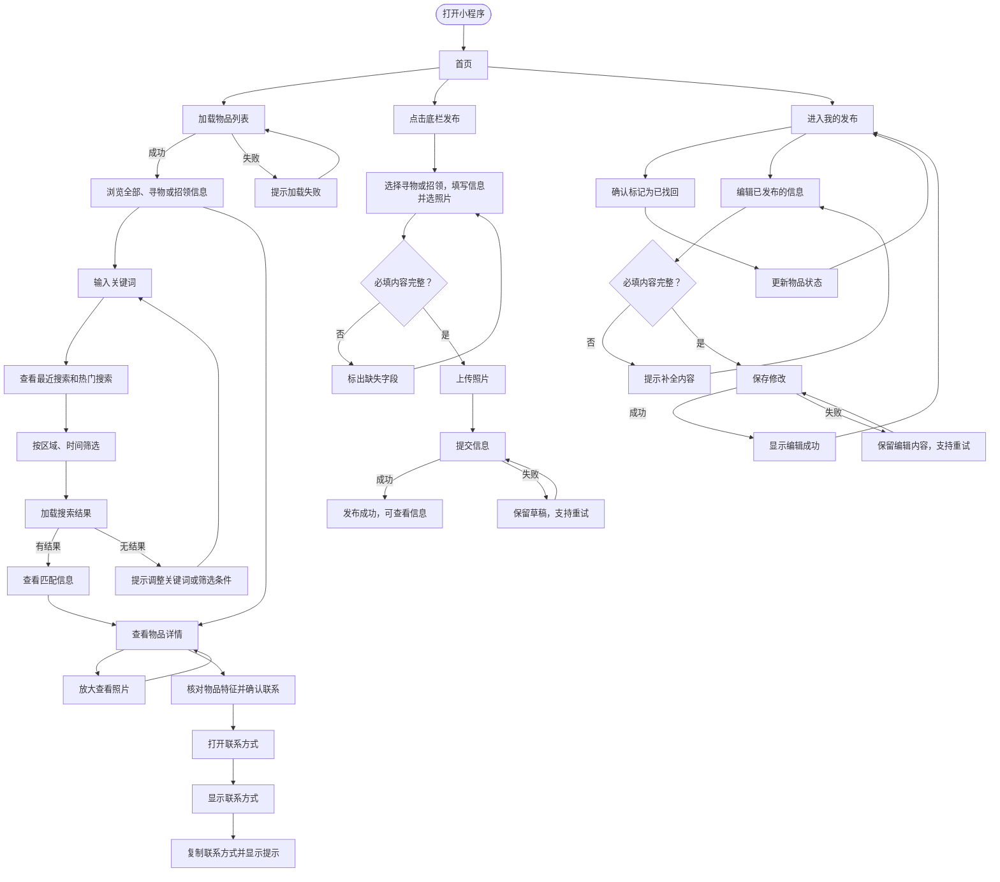

| 课程 | [H202601软件工程与软件工程实践](https://edu.cnblogs.com/campus/fzu/2026-01SoftwareEngineeringandSoftwareEngineeringPractice/) |
| :----------------- | :--------------- |
| 作业要求 | [2026秋软件工程个人作业（第三次）](https://edu.cnblogs.com/campus/fzu/2026-01SoftwareEngineeringandSoftwareEngineeringPractice/homework/16742) |
| 作业目标 | 完成「校园失物招领小程序」需求分析和原型设计 |
| 学号 | 102401301吴莉芊、102401339任宝硕 |

## 《构建之法》读后感

这几章读下来，我对软件工程中的个人成长、结对合作、需求分析和原型设计有了更清晰的认识。以前我对软件开发的理解比较简单，总觉得写代码、实现功能、把程序跑起来就是最主要的工作，但书里的内容让我发现，真正的软件工程远不止这些。一个软件工程师不仅要有扎实的技术能力，还要会分析问题、安排任务、估计工作量，也要能和团队成员保持有效的沟通，对自己负责的工作有明确的判断。工程师的成长也不能只看工作时间长短，更重要的是能不能独立解决问题，能不能在团队里稳定地完成任务，并不断调整自己的工作方法。

结对合作这一部分让我印象比较深。两个人结对合作并不是简单地把任务分成两半，各自写完自己的部分，而是一起面对同一个问题。一个人负责具体操作和编码，另一个人负责观察整体思路、检查代码、发现遗漏的问题，之后再交换角色。这样的工作方式看起来会占用更多沟通时间，但它能让很多问题在开发过程中就被发现，也能减少因为个人习惯和思维盲区造成的错误。两个人在讨论和修改代码的过程中，也会逐渐了解彼此的思路，代码不再只是某一个人的成果，而变成共同维护的内容。

需求分析这一章让我意识到，用户提出的要求并不一定等于真正的需求。很多时候，用户能清楚说出自己遇到了什么问题，却不一定知道应该怎样解决，所以开发人员不能只记录用户说了什么，还要通过访谈、问卷、观察、用户研究等方法了解实际的使用场景。不同的利益相关者关注的内容也不一样，有的人在意功能是否齐全，有的人更关心成本、性能、操作是否方便，这些需求需要经过整理和判断，再确定优先级。原型设计和需求分析之间也有很紧密的联系。正式开发之前，可以先用草图、简单页面或者模型把想法表现出来，让用户直接看到、尝试和反馈。原型不一定要做得精细，重点是尽早发现问题。如果流程设计不合理，或者用户对某个功能理解有偏差，在这个阶段修改通常比系统开发完成后再返工轻松得多。读完这些内容以后，我感觉软件开发其实是一个不断沟通、验证和调整的过程。很多最后暴露在代码里的问题，源头可能并不在代码本身，而是在前期需求没有弄清楚、团队理解不一致，或者设计没有经过足够的验证。把这些基础工作做扎实，后面的开发才会更顺一些。

## 题目来源

在校园生活中，同学们经常会遇到遗失校园卡、钥匙、水杯、雨伞、耳机、书籍等物品的情况。

目前，大家通常通过班级群、宿舍群、朋友圈等方式发布寻物或招领信息。但是这些信息比较分散，而且随着群聊消息不断增加，之前发布的信息很容易被新的消息覆盖，查找起来并不方便。

例如，一名同学在教学楼捡到一张校园卡，可能只能在自己的班级群或朋友圈发布招领信息，而丢失校园卡的同学未必能够看到这条消息。类似的情况也经常发生在宿舍区、食堂、图书馆和运动场等校园场所。

因此，希望设计一个简单的「校园失物招领小程序」，让同学们可以集中发布和查看寻物、招领信息，并通过物品名称等关键词进行搜索，提高校园失物寻找和归还的效率。

## 用户需求分析

这个小程序主要面向校内学生。实际使用时，大致有两类用户。一类是丢失物品的学生，他们希望尽快发布寻物信息，也希望能查到别人发布的招领信息。另一类是捡到物品的学生，他们需要把拾取地点、时间和物品特征发布出来，让失主有机会看到。

我们先从这些用户在校园里的实际处境出发，而不是直接列功能。《构建之法》第8章把利益相关者、用户调研和需求优先级放在需求分析过程中。 对这个项目来说，最直接的利益相关者就是发布寻物信息和招领信息的学生，因此我们主要围绕他们找东西、发布信息和确认物品状态的过程来设计。

目前失物招领信息通常出现在班级群、宿舍群和朋友圈里。不同学生所在的群并不相同，一条招领信息可能只覆盖很小的范围。群聊里的新消息不断增加，之前的信息也很容易被覆盖。即使知道有人发过相关内容，再回头翻聊天记录也比较麻烦。

因此，用户首先需要一个统一的入口。寻物和招领信息都放在同一个地方，打开小程序后可以直接浏览。用户如果已经知道自己要找什么，也应该能通过「学生证」「雨伞」「钥匙」等关键词搜索，而不是一条条翻看。

发布信息时，双方需要提供能够帮助判断物品的信息。寻物信息至少要有物品名称、丢失时间、丢失地点和物品特征。招领信息也需要记录拾取时间、地点和特征。图片可以帮助识别，但不是所有用户都能提供，所以我们把图片设计为选填内容。

联系方式也需要保留。这个小程序的任务是帮助双方找到对应的信息，我们并不准备在本次作业中实现复杂的即时聊天能力，这不管是从代码还是在合规上都是一个十分复杂的事情。用户在详情页确认信息后，可以通过发布者留下的联系方式继续沟通。

信息发布后还会出现一个问题。物品已经找回或者归还时，原来的内容如果继续显示为有效信息，会影响其他用户判断。因此我们增加了信息状态。寻物信息可以显示「寻找中」或「已找回」，招领信息可以显示「待认领」或「已归还」。

在确定功能时，我们也对需求做了取舍。实名认证、地图定位、即时聊天、消息推送等功能可能有用，但并不是当前流程必须具备的内容，而且会增加后续实现难度。本次原型先保留浏览、发布、搜索、查看详情和修改状态几个功能，把主要使用过程做完整。

## 功能设计

原型围绕「找信息」和「发信息」两件事展开。我们先画出用户从进入小程序到完成操作的流程，再根据流程确定页面。这样可以避免先画出很多页面，最后却发现页面之间无法顺畅连接。需求分析中确定的几个主要功能最终对应为首页、发布页面、搜索页面、信息详情、我的发布页面。

### 首页

首页是用户进入小程序后首先看到的页面。

页面顶部放置搜索入口，下方提供「全部」「寻物」「招领」三个分类。主要区域显示最近发布的信息，每条信息使用卡片展示。

卡片只放浏览时需要的信息，包括物品名称、寻物或招领类型、地点、时间和当前状态。例如：

> 招领 
> 校园卡 
> 一教三楼 
> 9月22日 
> 待认领

用户看到可能与自己有关的信息后，可以点击卡片进入详情页。首页不展示过多文字，具体特征和联系方式放在详情页中。

### 发布信息

发布页面同时承担发布寻物信息和招领信息的功能。

用户进入页面后先选择「寻物」或「招领」。之后填写物品名称、时间、地点、物品描述和联系方式，也可以上传图片。寻物和招领使用同一套页面结构，只在时间、地点等字段的文字上作区分。

例如选择「寻物」后，页面显示「丢失时间」和「丢失地点」。选择「招领」后，对应内容变为「拾取时间」和「拾取地点」。

填写完成后点击「发布」。如果必填信息完整，页面进入发布成功状态。这个反馈在原型中也保留下来，避免用户点击按钮后不知道操作是否完成。

### 搜索

搜索页面解决的是用户已经知道目标物品时的查找问题。

用户可以输入「学生证」「雨伞」「耳机」等关键词。结果页面继续使用首页的信息卡片，不另外设计一套展示方式。用户也可以选择只看寻物信息或只看招领信息。

例如丢失校园卡的学生搜索「学生证」后，可以先查看招领结果。如果看到时间和地点接近的信息，再进入详情页确认其他特征。

这种设计没有加入复杂的组合筛选。对于校园失物招领这一场景，物品名称和信息类型已经能够完成最基本的查找过程。

### 信息详情

详情页用于展示一条信息的完整内容。

页面显示物品名称、信息类型、图片、时间、地点、特征描述、联系方式和当前状态。列表页面负责帮助用户快速判断是否值得继续查看，详情页面再提供完整信息。

例如用户在首页看到「黑色雨伞」的招领信息后，可以进入详情页查看拾取地点和时间。如果与自己的情况接近，再通过页面中的联系方式与发布者联系。

这里没有设计站内聊天。联系方式直接显示在详情页中，也可以设置「复制联系方式」按钮。

### 我的发布

「我的发布」用于管理自己已经发布的信息。

用户可以在这里查看之前发布的寻物和招领内容，也可以修改信息状态。寻物信息找到后可以改为「已找回」，招领物品交还失主后可以改为「已归还」。

我们加入这个页面，主要是因为发布并不是流程的终点。一条信息在物品找回后还需要结束。状态修改后，其他用户也能知道这条信息是否仍然有效。

## 用户使用流程

用户打开小程序后进入首页。首页显示校园失物招领的横幅和物品列表。每条信息包含物品图片、名称、地点、日期和当前状态。用户可以在「全部」「寻物」「招领」之间切换，先找到自己关心的信息类型。列表加载时，页面显示占位内容。如果加载失败，页面给出重试入口。

用户可以从首页进入搜索页，输入物品名称或地点等关键词。输入过程中，页面显示最近搜索和热门搜索。提交关键词后，用户可以浏览匹配的物品，也可以按区域和时间缩小范围。搜索结果加载时，列表暂时显示占位内容。没有匹配结果时，页面提示用户更换关键词或调整筛选条件。

用户点开一条信息后，可以查看物品照片、名称、拾到时间、地点和描述。点击照片可以打开大图，便于核对外观。详情页还显示发布者留下的联系方式。准备联系发布者时，用户先确认自己了解物品特征，避免误领。页面随后显示联系方式，并在打开过程中给出等待提示。用户复制联系方式后，页面提示复制成功。

需要发布信息时，用户点击底栏中间的「发布」。发布页提供「寻物」和「招领」两种类型。用户填写物品名称、丢失或拾到的时间与地点、物品描述和联系方式，还可以选择照片上传。照片上传时，页面显示上传进度。用户提交前如果漏填必填内容，页面会标出对应字段，并保留已经填写的信息。

填写完成后，用户点击「立即发布」。提交期间，页面显示正在发布的状态，避免用户重复操作。发布成功后，页面展示新发布的物品，并提供查看信息和返回首页的入口。如果提交失败，用户可以返回草稿检查内容，再次发布。

用户进入「我的」后，可以在「我的发布」中查看自己发布的物品及其状态。物品找回后，用户点击状态按钮，确认后将信息标记为「已找回」。状态更新期间，页面显示处理状态。用户也可以打开编辑页，修改物品信息、联系方式或照片。

保存编辑内容时，页面先检查必填字段。联系方式为空时，输入框会显示提示，用户补全后可以继续保存。保存期间，页面显示等待状态。保存成功后，用户可以返回「我的发布」查看更新后的信息。保存失败时，页面保留编辑内容，并提供重试入口。

流程图：

## 原型设计

原型设计工具我们使用的是 Figma。下面是我们原型设计的页面截图。[Figma 共享链接](https://www.figma.com/design/mRskw63SkxU7BZCskUySsJ/%E8%BD%AF%E4%BB%B6%E5%B7%A5%E7%A8%8B%E4%BD%9C%E4%B8%9A3-%E6%A0%A1%E5%9B%AD%E5%A4%B1%E7%89%A9%E6%8B%9B%E9%A2%86%E5%B0%8F%E7%A8%8B%E5%BA%8F?node-id=34-1049&t=gpckJEMVUREuJ0i1-1)。

## 结对过程

这次作业虽然没有写代码，我们还是参考了《构建之法》第3章中结对工作的方式。两个人没有完全拆成互不相关的两份任务，而是在需求分析和原型设计过程中互相检查。

第一次整理需求时，一人负责记录用户场景、功能和页面，另一人检查有没有遗漏，以及某个功能是否真的需要加入。确定 P0、P1 和 P2 后，我们再开始画页面。这样做主要是为了防止原型越画越多，最后超出下一次实现能够承担的范围。

进入 Figma 后，一人负责实际修改页面，另一人检查页面跳转、字段是否一致，以及用户完成当前操作后下一步应该去哪里。检查完一轮后再交换。我们重点核对了发布、搜索、详情和状态修改几个流程。

原型也不是一次完成的。前期更关注页面长什么样，后面开始检查加载失败、没有搜索结果、表单缺项、提交失败和保存失败这些状态。博客文字也跟着原型调整。比如搜索功能最后没有继续增加区域和时间的组合筛选，收藏也没有作为本次正式功能保留。

## PSP

| PSP 阶段 | 预估时间/min | 吴莉芊实际时间/min | 任宝硕实际时间/min |
| --- | ---: | ---: | ---: |
| 阅读任务并讨论需求 | 45 | 30 | 30 |
| 需求分析 | 40 | 45 | 45 |
| 功能与页面规划 | 30 | 20 | 20 |
| 整理用户流程 | 30 | 40 | 40 |
| Figma 原型制作 | 360 | 300 | 300 |
| 结对检查与修改 | 40 | 40 | 40 |
| 博客整理 | 90 | 60 | 45 |
| 个人总结 | 30 | 15 | 10 |
| 合计 | 635 | 550 | 530 |

## 个人总结

### 任宝硕

这次做原型时，我开始时比较关注页面是否好看，后面发现页面之间能不能顺利走完更重要。用户点击发布之后去哪里，搜索不到内容怎么办，保存失败后原来的输入还在不在，这些问题不一定会体现在一张静态截图里，但会直接影响实际使用。

前期我们绘制的视觉草图帮助我们较快确定了风格，但是对于交互的细节状态后面还是需要回到 Figma 里逐页检查和修改。原型并不是把几个界面画出来就结束了，还要不断对照需求，看页面里有没有多余功能，主要流程有没有断掉。这次把这些问题提前处理，也能给下一次真正实现小程序留下一份更明确的范围。

### 吴莉芊

这次作业里，我对需求分析的理解比以前具体了一些。开始时很容易想到“还能再加什么功能”，但真正整理以后发现，确定哪些功能不做同样重要。地图、聊天、收藏都可以继续扩展，但它们不是这次失物招领流程必须具备的内容。把范围缩到浏览、发布、搜索、详情和状态管理之后，页面之间的关系反而更容易理清。

结对检查也发现了不少一个人容易忽略的问题。有些文字自己写完后会默认它是对的，另一人从用户流程重新走一遍，更容易看出前后的字段、状态和跳转是否一致。
